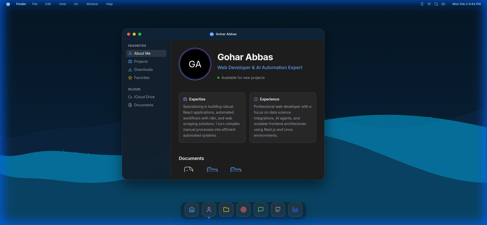
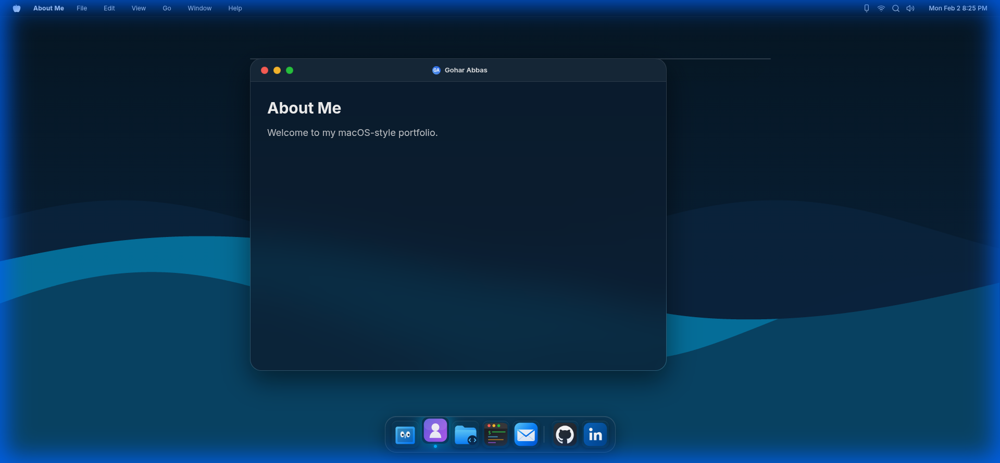
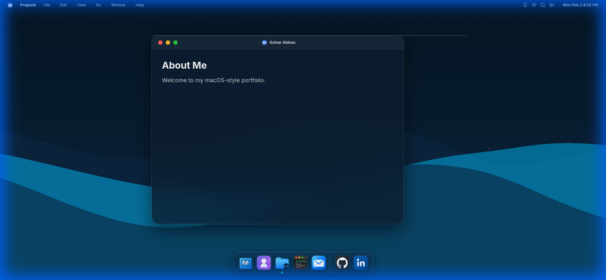

# MacOS Style Portfolio

A premium, interactive macOS-themed portfolio built with React, Vite, and Express. This project replicates the macOS user experience with a functional dock, draggable windows, a terminal emulator, and sleek animations.

## 🚀 Key Features

- **macOS Desktop Experience**: Fully interactive desktop environment with authentic macOS physics.
- **Functional Dock**: Smooth magnification effect, hover glow, and active window indicators.
- **Draggable Windows**: Multiple windows (About, Projects, Terminal) that can be dragged, minimized, and closed.
- **Interactive Terminal**: A command-line interface to explore skills and background.
- **Projects Gallery**: A Safari-style window showcasing professional work and expertise in automation and web scraping.
- **Responsive Design**: Adapts the desktop experience for various screen sizes, including mobile-optimized shortcuts.
- **Glassmorphism UI**: High-end visual aesthetics using modern CSS techniques.

## 📸 Screenshots

### Desktop View (Landing)


### About Me Section


### Projects Portfolio


## 🛠 Tech Stack

- **Frontend**: React.js, Vite, Tailwind CSS, Framer Motion, Lucide React.
- **Backend (Serverless)**: Express.js, TypeScript, Node.js (Vercel Functions).
- **Styling**: Vanilla CSS for premium macOS-style glassmorphism and animations.
- **Deployment**: Optimized for Vercel with automatic serverless function routing.

## 📦 Getting Started

### Prerequisites

- Node.js (v18 or higher)
- npm or pnpm

### Installation

1. Clone the repository:
   ```bash
   git clone git@github.com:GoharAbbas2122804/MacOS_Style_Portfolio.
   ```

2. Install dependencies:
   ```bash
   npm install
   ```

3. Start the development server:
   ```bash
   npm run dev
   ```

4. Open [http://localhost:5000](http://localhost:5000) in your browser.

## 🏗 Build & Deploy

To build the client-side assets for production:

```bash
npm run build
```

The production-ready files will be located in the `dist/public` directory.

### Vercel Deployment

This project is configured for seamless deployment on Vercel. Simply push your code to a GitHub repository and link it to Vercel. The `vercel.json` and `api/` folder handle the serverless routing automatically.

## 👨‍💻 Author

**Gohar Abbas**
- Expert in Web Automation & Scraping
- Professional Software Engineer

---

*This project was developed with a focus on high-end UI/UX and modern web performance standards.*
